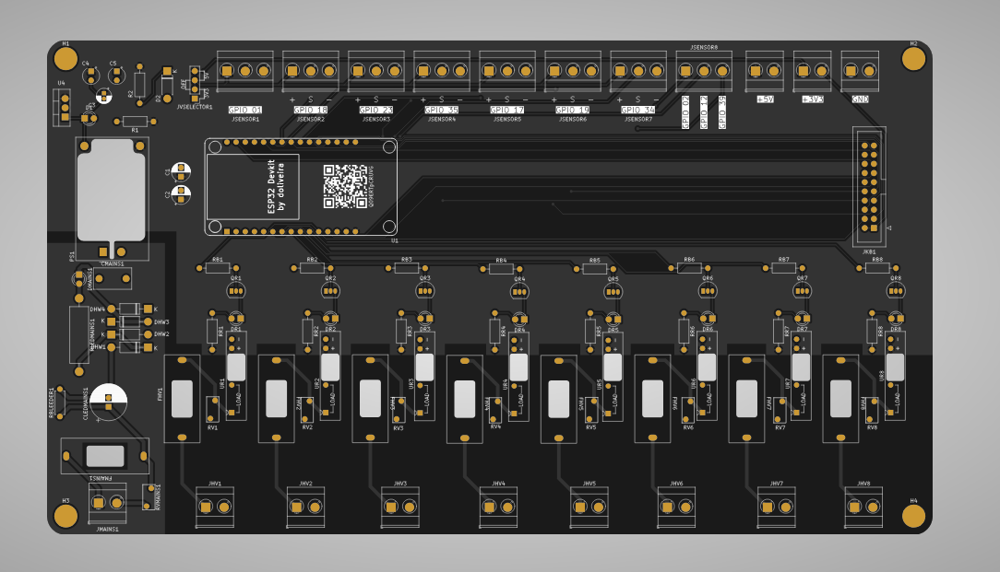
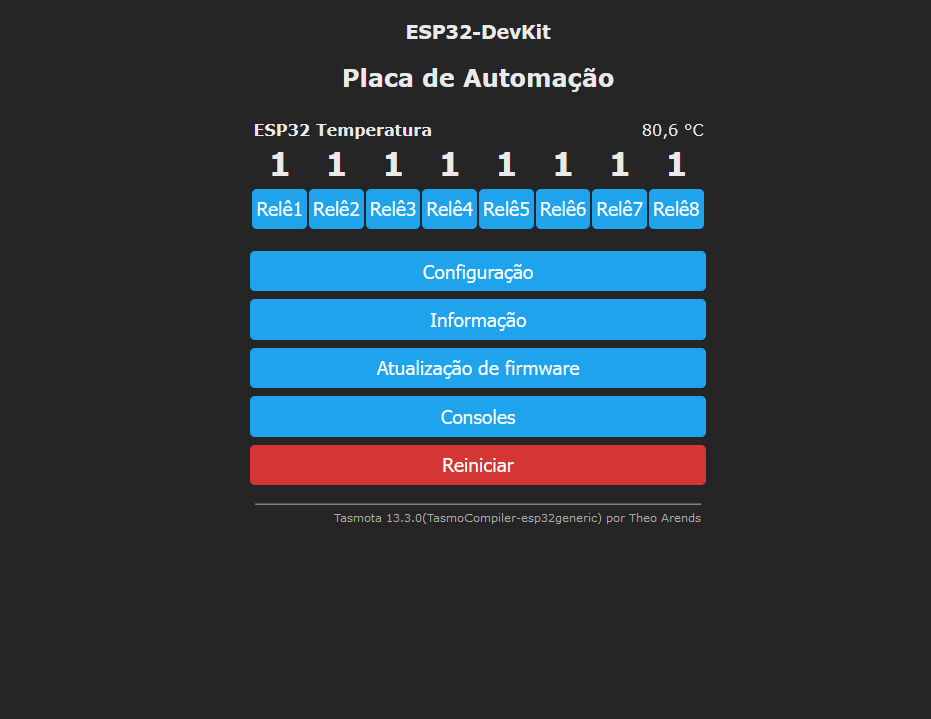
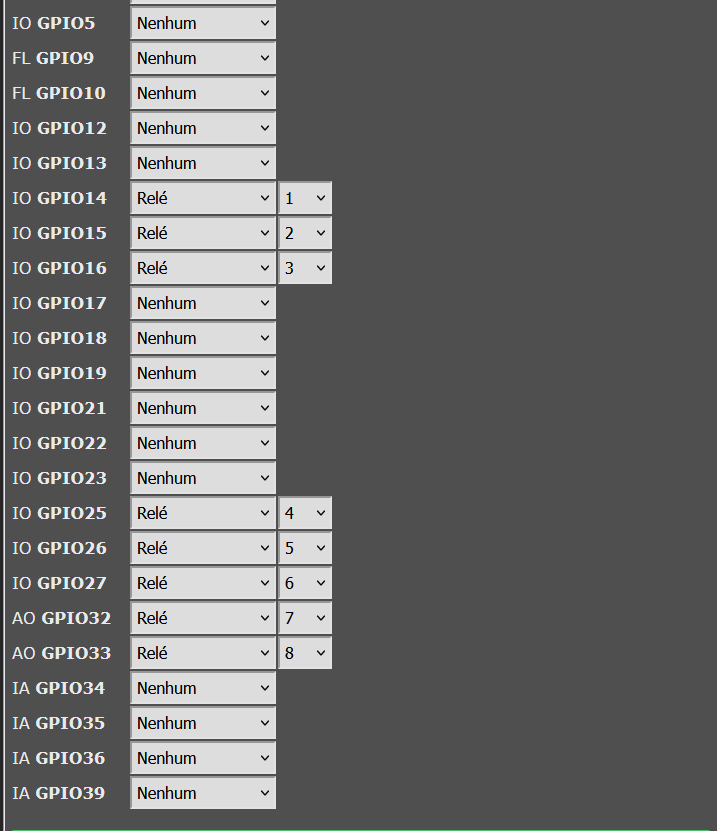
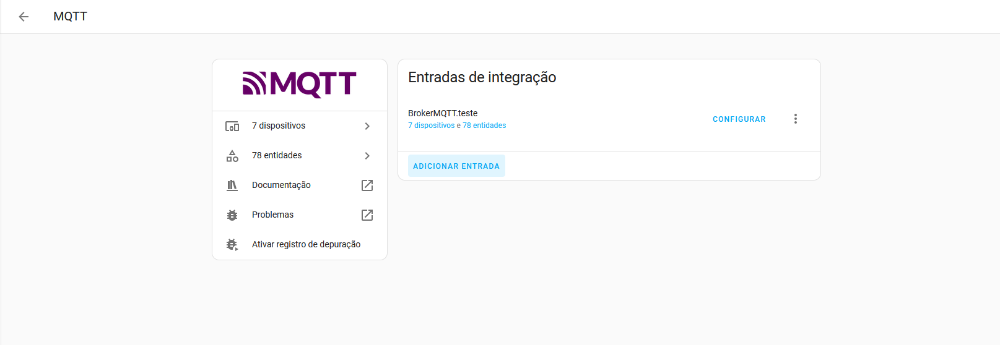
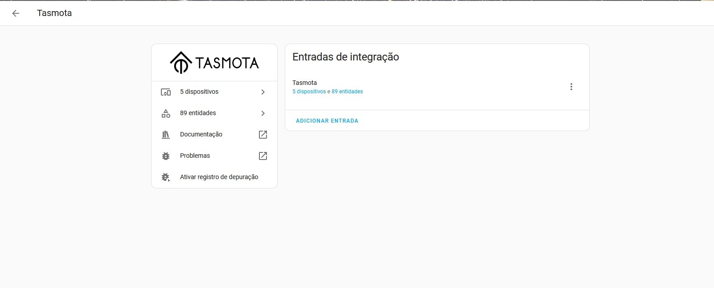
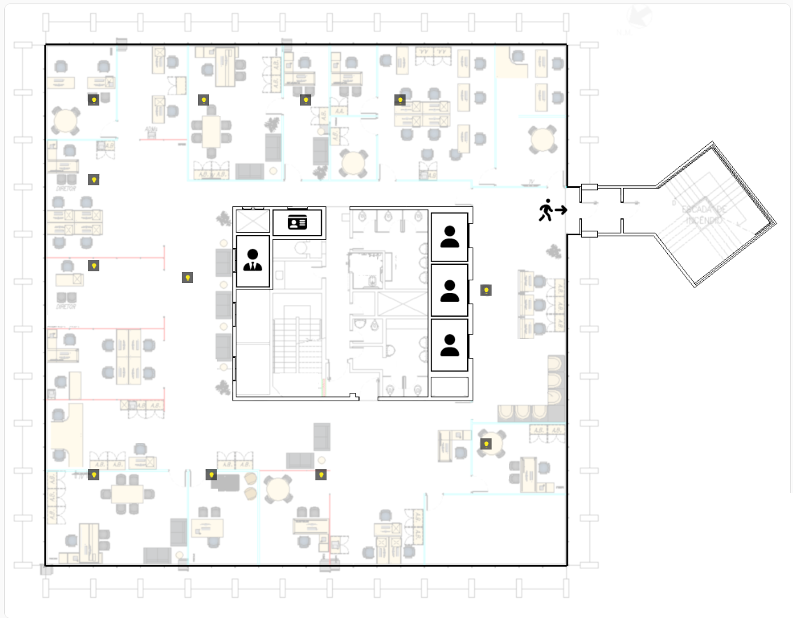
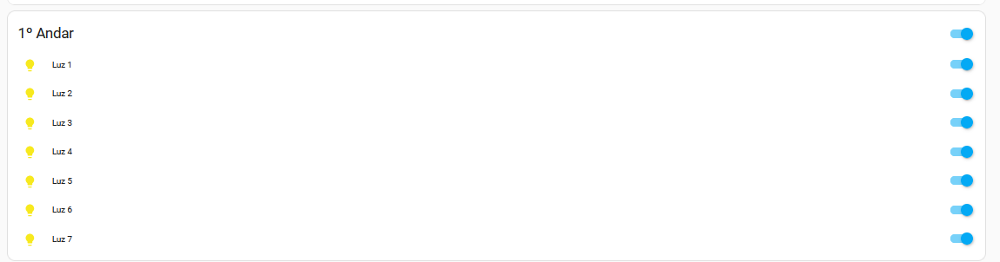

# Controle de Disjuntores com ESP32, Tasmota e Home Assistant

## Descrição do Projeto
Este projeto apresenta o desenvolvimento de uma placa de automação projetada para controlar **disjuntores** através de um **ESP32** com o firmware **Tasmota** instalado. O ESP32 atua como endpoint MQTT, e todas as informações e controles são exibidos no **Home Assistant**.

## Visão Geral do Projeto

### Imagem da Placa

A placa foi projetada para facilitar o controle remoto dos disjuntores, garantindo um sistema robusto e integrado.

---

## Instalação do Firmware Tasmota no ESP32

Para utilizar a placa, é necessário instalar o firmware **Tasmota** no ESP32. Certifique-se de configurar corretamente o MQTT com o seu próprio broker e seguir a pinagem descrita abaixo:

### Interface Inicial do Tasmota

### Configuração de Pinagem no Tasmota

---

## Configuração do Home Assistant

### 1. Configurar o Broker MQTT
No **Home Assistant**, configure seu Broker MQTT para a comunicação com o dispositivo Tasmota.

Assim que o MQTT estiver configurado corretamente, o dispositivo deve ser detectado automaticamente.

### Integração com o MQTT no Home Assistant

### Integração com o Tasmota

---

## Configuração da Dashboard no Home Assistant

Com a integração concluída, os botões de controle dos disjuntores podem ser adicionados à **dashboard** do Home Assistant. Isso permite o controle direto dos disjuntores com apenas um clique.

### Planta Integrada

### Botões de Controle

---

## Requisitos
- **ESP32**
- **Placa de automação**
- **Firmware Tasmota**
- **Broker MQTT** (local ou em nuvem)
- **Home Assistant** configurado

---

## Tags de Tecnologias Utilizadas

---

## Guia de Uso
1. Instale o firmware **Tasmota** no ESP32 e configure o MQTT.
2. Conecte o ESP32 à placa de automação.
3. Configure o Broker MQTT no Home Assistant.
4. Integre o dispositivo Tasmota no Home Assistant.
5. Adicione os botões à dashboard e comece a controlar os disjuntores!

---

## Imagens do Projeto

1. **PCB da Placa** 
2. **Interface Inicial do Tasmota** 
3. **Configuração de Pinagem** 
4. **Integração MQTT no Home Assistant** 
5. **Integração com o Tasmota** 

---

## Licença
Este projeto está licenciado sob a **MIT License**.
